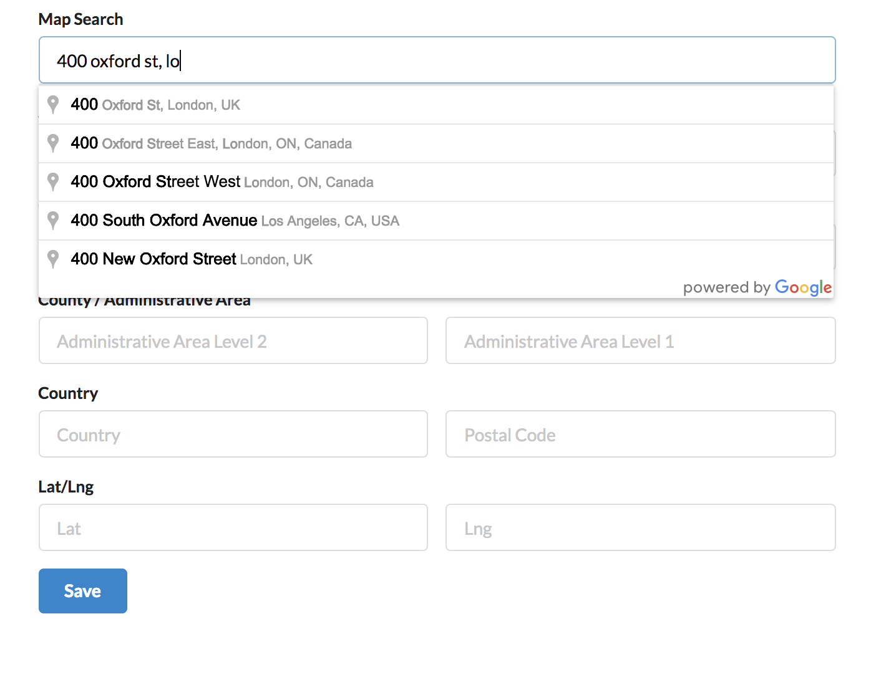
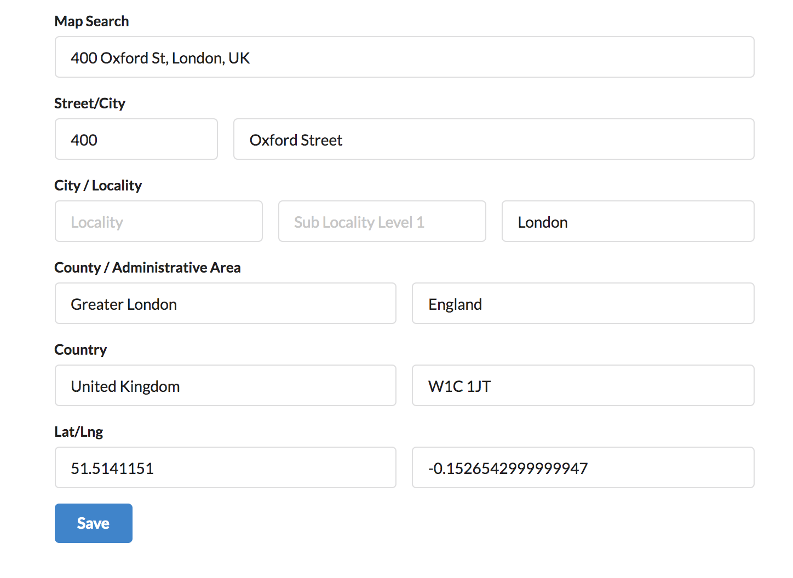

[ATK UI](https://github.com/atk4/ui) implements a high-level User Interface for Web App - such as **Admin System**. One of the most common things for the Admin system is a log-in screen.

This add-on will transform a form input field into a Google place autocomplete field. 
Once value is select in Goolge autocomplete, it will automatically populate other form 
input field. 

## Installation

Install through composer `composer require atk4/google-address`

## Example


Start typing in order to start gettings results from Google place api.



Then form field is populate automatically when a place is select from the dropdown.



## Usage

Simply add the google-address field in your form with your existing address field.

```
$f->addField('map_search', [new atk4\GoogleAddress\AddressLookup(['apiKey' => $key])]);
```

Note: Do not forget to set your Google developper api key. 

The autocomplete will populate other field data in your form automatically if fields in form 
use the same name as the google address_components field.

### Specifying field mapping

You can set which value from the google address_component value will be filled in your form's input field by using
AddressLookup::mapGoogleComponentToField() method.

The method accepts three arguments: 
 - $fieldName: the name of the field place in form,
 - $googleComponent: the googleComponent result to set in fieldName,
    - either pass a string or an array of googleComponent field name. When
    passing an array of components, these will be concatenate using the third
    arguments $glue.
 - $glue: a string to use as a glue betweeen component value.   
 
### Example

This will retrieve the content of street_number from google place result and insert it in field named 'address' in form.
```
$ga = $f->addField('map_search', [new atk4\GoogleAddress\AddressLookup(['apiKey' => $key])]);

$ga->mapGoogleComponentToField('address', 'street_number');
```

You may combine multiple google address_components into one form field as well,

Here the address field will contain street_number and route seperate by the glue value. 
You may specify as many google address_component as needed to be concatenate to one value.
```
$ga->mapGoogleComponentToField('address', ['street_number', 'route'], $glue);
```

Finally, A google address_component may have two values, a short_name or a long_name value. Ex, a country address_component can be specify using 
the long name, i.e United Kingdom or it's short name 'UK'. 
You can choose to use the long or short name value by specifying it in $googleCompents.


This will concatenate the google address_component country by using it' short name and the postal_code value.
ex: 'UK / W1C 1JT'

```
$ga->mapGoogleComponentToField('country', ['country' => 'short_name', 'postal_code'], ' / ');
```